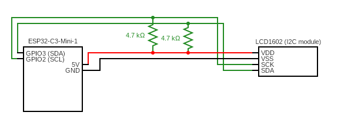

# LCD 16X2 I2C ESP32 Driver

## About the project
A complete driver for Hitachi compatible 16 x 2 modules with the i2c expander on ESP32. The driver runs the LCD in 4-bit mode and exposes a small and easy to use API for initialization and writing.

## Functions
* Automatic background light (controlled by the i2c expander-pins)
* Logic for handling \n and character overflow.

## Pre-requisites

### ESP-IDF
Espressifs IoT development framework, which contains all the essential dependencies for this project. You can find a guide for installing it here: https://docs.espressif.com/projects/esp-idf/en/stable/esp32/get-started/index.html

### ESP32 device
You can use any device, but might need to configure the pins.

### LCD 1602
Make sure it's Hitachi 44780 compatible and has a I2C expander.

### GCC and Cmake
For compiling and building the project.

**GCC For windows**  
[Guide for windows](https://medium.com/@anazilthottunghal/a-guide-to-installing-gcc-on-windows-5cc95c2f38c4)

**GCC For Mac**  
`brew install gcc`

**GCC For Linux**  
`sudo apt-get install gcc`

**Cmake**  
This is our build tool for the project and routinely used for raspberry pi pico projects.

[You can download it here](https://cmake.org/download/)

## Pinout
The driver standard pinout is set in **lcd_i2c.h**:

```c
#define I2C_MASTER_SCL_IO           GPIO_NUM_2                  /*!< GPIO number used for I2C master clock */
#define I2C_MASTER_SDA_IO           GPIO_NUM_3                  /*!< GPIO number used for I2C master data  */
```

Example of circuit for this driver



## Installation

### 1. Clone the project
Clone this project into `components/` in your project. ESP-IDF will automatically recognize the file and it can then be used in your project.

`git clone https://github.com/lafftale1999/lcd_1602_i2c_driver.git`

## API-reference

**lcd_1602_init()**  
Initializes the LCD according to the datasheet. Returns 0 if successful.
```c
uint8_t lcd_1602_init(i2c_master_dev_handle_t handle);
```

**lcd_1602_send_string()**  
Writes out string on the display. Returns LCD_WRITE_FINISHED if successful. LCD_WRITE_INTERRUPTED if string is too long for screen.
```c
LCD_WRITE_STATUS lcd_1602_send_string(i2c_master_dev_handle_t handle, char *str);
```

## Macros
These can be changed to fit your own project.
```c
#define DEVICE_ADDRESS  0x27            /**< Device address. Standars is often 0x27 */
#define LCD_1602_SCREEN_CHAR_WIDTH 16   /**< Max character width of the screen */
#define LCD_1602_MAX_ROWS 2             /**< Max rows available on the screen */
```

## Build and flash
This project is not made to build on its own, it needs to be incorporated into a bigger system with a CMake build file.

## Documentation
You can find the documentation for the project here: https://lafftale1999.github.io/lcd_1602_i2c_driver/index.html


## About the author
I'm currently studying to become an embedded developer and learning about writing drivers based on datasheets from manufacturers. If you have any questions please feel free to reach out!